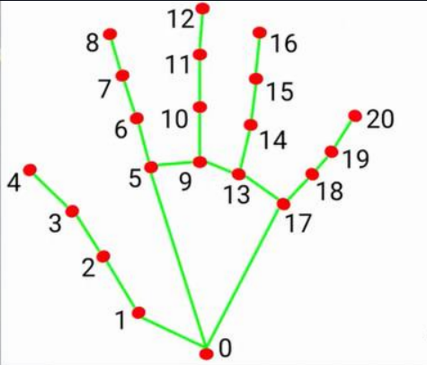
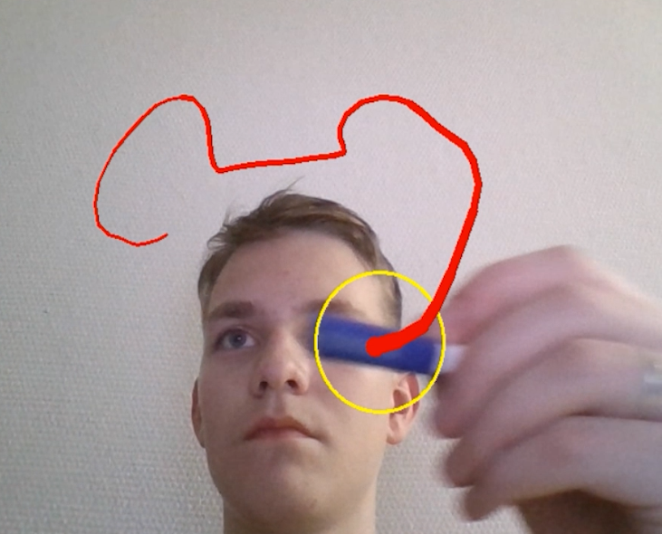

#Распознавание Жестов Рук
Для запуска модели определения ключевых точек на кисти требуется запустить файл **Hand/Basics.py**  
**Ключевые точки:**
  
Для запуска модели классификации жестов необходимо запустить файл **Hand/sign_language/src/camera.py**  
**Алфавит:** 
#Распознование Мимики Лица
Для запуска модели распознования эмоций по мимике лица необходимо запустить файл **Emotion/emotions.py**  

#Распознование речи
Для запуска модели распознования речи необходимо запустить файл **Speech/test.py**  
#Рисование в воздухе
Для запуска модели рисования в воздухе необходимо запустить файл **Hand/writing/Write.py**

#Игра
**После запуска всех моделей** для запуска игры необходимо запустить файл **Interface/main.py**